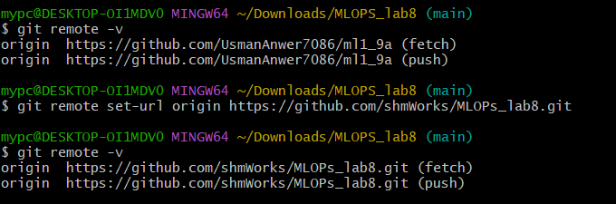

### 1. Clone the Remote Repository

The first step is to create a local copy of the shared remote repository. The `git clone` command downloads the project from GitHub to your local machine.

```bash
$ git clone https://github.com/shmworks/MLOPS_lab8
```


### 2. Setting Up the Remote URL

To ensure you are pushing to the correct repository, you can set the remote URL using `git remote set-url`.


```bash
$ git remote set-url origin https://github.com/shmworks/MLOPS_lab8.git
```
You can verify the new remote URL with `git remote -v`.



### 3. Pushing the Initial `main` Branch

After cloning, you may need to push the local `main` branch to the remote repository to establish tracking.

```bash
$ git push -u origin main
```


### 4. Create and Manage Feature Branches

To work on new features without affecting the main codebase, developers create separate branches. Here, three feature branches (`feature/login`, `feature/dashboard`, `feature/api`) are created and pushed to the remote repository.

```bash
$ git branch -a # Lists all local and remote branches
$ git push -u origin feature/login
$ git push -u origin feature/dashboard
$ git push -u origin feature/api
```


The branches are now visible on the GitHub repository.


### 5. Modify the Same File on a Feature Branch

On the `feature/login` branch, the `housepk_app.py` file is modified. The `git diff` command shows the changes made.

```bash
$ git diff --staged
```

These changes are then staged, committed, and pushed to the remote `feature/login` branch.

```bash
$ git add housepk_app.py
$ git commit -m "Added login-specific print and comment to index route"
$ git push
```


### 6. Merging a Feature Branch into `main`

The `main` branch is updated by merging the changes from `feature/login`. This is a "fast-forward" merge because there are no conflicting changes on `main`.

```bash
$ git switch main
$ git merge feature/login
```


### 7. Introducing a Conflicting Change

Next, another developer merges changes from the `feature/dashboard` branch into `main`. This branch contains changes to the *same lines* of the `housepk_app.py` file that were modified in `feature/login`.

```bash
$ git merge feature/dashboard
```

This results in a merge conflict because Git cannot automatically decide which changes to keep.


### 8. Identifying and Resolving the Merge Conflict

The file is now in a conflicted state, marked by Git. The conflict markers (`<<<<<<<`, `=======`, `>>>>>>>`) show the different versions of the code from the `main` branch (Current) and the `feature/dashboard` branch (Incoming).


To resolve the conflict, the developer manually edits the file to combine the desired changes from both branches. In this case, both print statements are kept.


### 9. Committing and Pushing the Resolved Code

After resolving the conflict, the file is staged and committed to finalize the merge.

```bash
$ git add housepk_app.py
$ git commit -m "Resolved merge conflict between feature-login and feature-dashboard"
$ git push
```


### 10. Merging Another Feature Branch

Finally, the `feature/api` branch is merged into `main`. Since the previous conflict was resolved, this merge might be a fast-forward or require another resolution depending on its changes. The image shows the process of switching branches and applying changes.


After all branches are merged and conflicts are resolved, the `main` branch contains the combined work of all developers. All team members can then pull the updated `main` branch to synchronize their local repositories.

```bash
$ git pull
```
